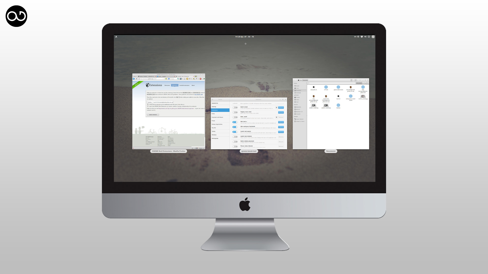
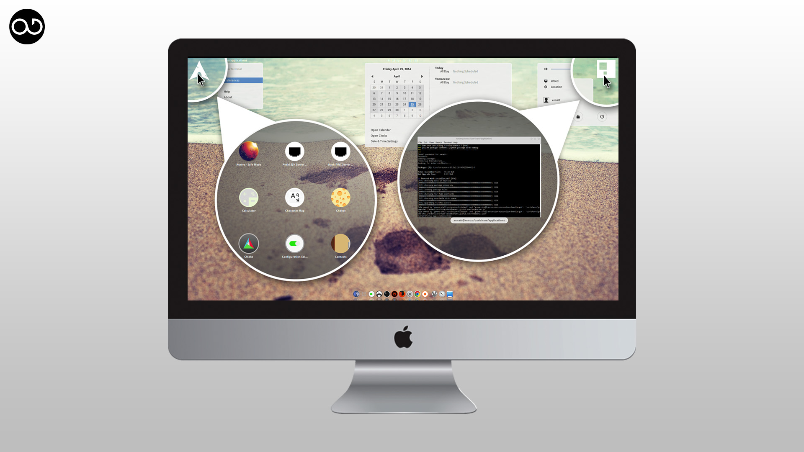

# Minimalism Gnome Shell Project

Minimalism Gnome Shell Extensions

-----------------

## Installation

**[Gnome.org's Extensions](https://extensions.gnome.org/)**

[Launch And Expose](https://extensions.gnome.org/extension/811/launch-and-expose/)
Show all running windows in an overview when clicking in the upper right corner, show all apps in an overview when clicking in the upper left corner.

[Hide Dash X](https://extensions.gnome.org/extension/805/hide-dash/)
Hide the dash from the activities overview.

[Hide Workspace Thumbnails](https://extensions.gnome.org/extension/808/hide-workspace-thumbnails/)
Hide workspace thumbnails from the overview. But don't worry they are still present and one can switch between them like usual with e.g. shortcuts.

---------------

## Screenshots

**Hide Dash X**


**Hide WorkSpace Thumbnails And Dash**



**Launch And Expose**


-----------

## The idea behind the structure of this repo
Each extensions has its own subfolder under the project root directory. The according folder should contain all files and assets which are requiered for the extension to properly work.

## Commands
* Adding git-hooks (through bash)
```bash
for hook in $(git rev-parse --show-toplevel)/*.hook; do
	(cd "$(git rev-parse --show-toplevel)"
		&& ln -s "../../$(basename ${hook})" ".git/hooks/$(basename ${hook%.hook})");
done
```


## Hooks
* pre-commit
> Reject whitespace errors, and auto-generate zip file ready to upload to the Developer Dashboard.

## Author

Gordian Edenhofer

Nattapong Pullkhow (until April 2014)

## License

Unless otherwise stated, the files in this project may be distributed under the terms of the GNU General Public License as published by the Free Software Foundation; either version 2 of the License, or any later version. This work is distributed in the hope that it will be useful, but without any warranty; without even the implied warranty of merchantability or fitness for a particular purpose. See [version 2](https://www.gnu.org/licenses/old-licenses/gpl-2.0.html) and [version 3] (https://www.gnu.org/copyleft/gpl-3.0.html) of the GNU General Public License for more details.
